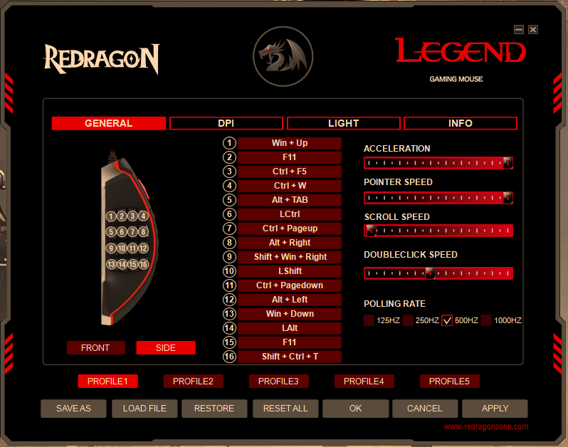
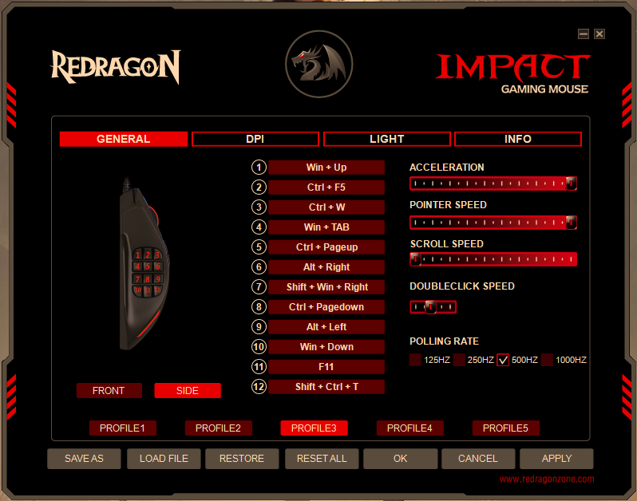

# micekeys

Buttons layout for my programmable mice (not robots).

## Redragon Legend M990

### Description
- 16 side buttons
- Price: usual ~$35, max discount ~$24
- Supported OS: Windows

### Side buttons Layout
| Row \| Column | Front                       | Front-Mid     | Back-Mid          | Back                        |
| ------------- | --------------------------- | ------------- | ----------------- | --------------------------- |
| Top           | `Ctrl-W`                    | `Alt-Right`   | `Alt-Left`        | `Ctrl-Shift-T`              |
| Upper-Mid     | `Ctrl-F5`                   | `Ctrl-PageUp` | `Ctrl-PageDown`   | `Win-Tab`                   |
| Lower-Mid     | `F11`                       | `Shift`       | `Ctrl`            | `Alt-Space N`(1) |
| Bottom        | `Alt-Space X`(1) | `Alt-Tab`     | `Win-Shift-Right` | `Win-Down`                  |

_Outdated Layout_

### Usage

#### Top Row
- Mostly for interacting with a tab (in explorer, browser, IDE)
- Middle 2 keys = Backward vs. Forward
- Front vs. Back = Close tab vs. Reopen closed tab

#### Upper-Mid Row
- Mostly for moving between tabs (in browser, IDE)
- Middle 2 keys = Next vs. Previous tab position-wise(2)
- Front-most = reload browser tab (refresh cache)
- Back-most = Window task view

#### Lower-Mid Row
- Supplementary keys
- Middle 2 keys = Shift vs. Ctrl, to combo with Mouse Wheel (Shift-Scroll = Horizontal scrolling, Ctrl-Scroll = Zoom in/out)
- Front vs. Back = Full screen vs. Fully-minimize window

#### Bottom Row
- Mostly for manipulating screens
- Front vs. Back: Maximize vs. Restore down (Minimize) window
- Front-Mid: Switch between windows (2 most recently active)
- Back-Mid: Move window to another screen/monitor

## Redragon Impact M908

### Description
- 12 side buttons
- Price: usual ~$30, max discount ~$20
- Supported OS: Windows

### Side buttons Layout
| Row \| Column | Front     | Front-Mid     | Back-Mid          | Back                        |
| ------------- | --------- | ------------- | ----------------- | --------------------------- |
| Top           | `Ctrl-W`  | `Alt-Right`   | `Alt-Left`        | `Ctrl-Shift-T`              |
| Upper-Mid     | `Ctrl-F5` | `Ctrl-PageUp` | `Ctrl-PageDown`   | `Alt-Space N`(1) |
| Bottom        | `Win-Up`  | `Alt-Tab`     | `Win-Shift-Right` | `Win-Down`                  |

_Outdated Layout_

### Usage

#### Top Row
- Mostly for interacting with a tab (in explorer, browser, IDE)
- Middle 2 keys = Backward vs. Forward
- Front vs. Back = Close tab vs. Reopen closed tab

#### Upper-Mid Row
- Mostly for moving between tabs (in browser, IDE)
- Middle 2 keys = Next vs. Previous tab position-wise(2)
- Front-most = reload browser tab (refresh cache)
- Back-most = Full screen vs. Fully-minimize window

#### Bottom Row
- Mostly for manipulating screens
- Front vs. Back: Maximize vs. Minimize window
- Front-Mid: Switch between windows (2 most recently active)
- Back-Mid: Move window to another screen/monitor

## Footnotes

- (1) Macro: 20ms between keystrokes.
- (2) I prefer Ctrl-PageUp/Down (strictly position-wise) over Ctrl-(Shift)-Tab (chronological order in VSCode & Sublime Text, positional order in web browsers)

## Tudu

- Experiment with Double click key
- Experiment with DPI keys (hardly ever change DPI)
